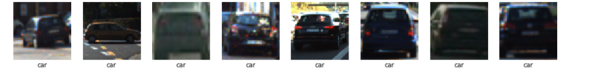
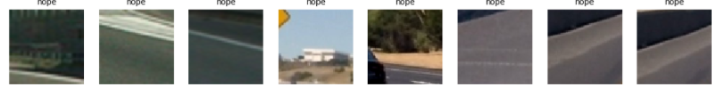
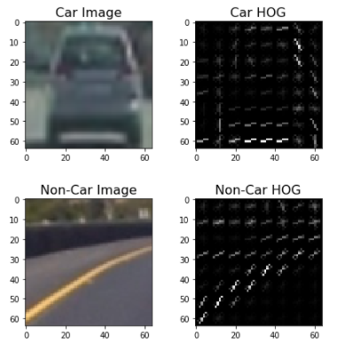
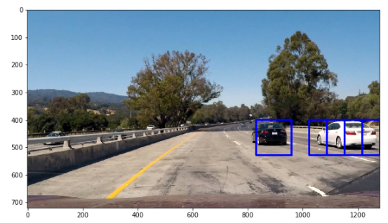
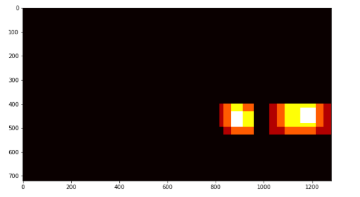
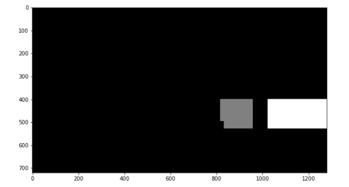
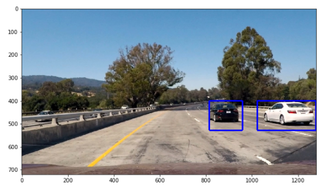

**Vehicle Detection Project**

The goals / steps of this project are the following:

* Perform a Histogram of Oriented Gradients (HOG) feature extraction on a labeled training set of images and train a classifier Linear SVM classifier
* Optionally, you can also apply a color transform and append binned color features, as well as histograms of color, to your HOG feature vector. 
* Implement a sliding-window technique and use your trained classifier to search for vehicles in images.
* Run your pipeline on a video stream (start with the test_video.mp4 and later implement on full project_video.mp4) and create a heat map of recurring detections frame by frame to reject outliers and follow detected vehicles.
* Estimate a bounding box for vehicles detected.

#### Prepping the data
I started by reading in all the `vehicle` and `non-vehicle` images.  Here is an example of one of each of the `vehicle` and `non-vehicle` classes:



#### Histogram of Oriented Gradients (HOG)

To calculate a HOG descriptor, we need to first calculate the horizontal and vertical gradients; after all, we want to calculate the histogram of gradients .The code for this step is contained in the first code cell of the IPython notebook  in car-detection.ipynb  it consists of the following steps 

    *  Create a list to append feature vectors to
    *  Read in each one by one
    *  Apply color conversion if other than 'RGB'
    *  Do hog transform on the image 
 
We can specify the number of orientations, pixels_per_cell , and cells_per_block for computing the HOG features of a single channel of an image. The number of orientations is the number of orientation bins that the gradients of the pixels of each cell will be split up in the histogram. The pixels_per_cells is the number of pixels of each row and column per cell over each gradient the histogram is computed. The cells_per_block specifies the local area over which the histogram counts in a given cell will be normalized. Having this parameter is said to generally lead to a more robust feature set. We can also use the normalization scheme called transform_sqrt which is said to help reduce the effects of shadows and illumination variations. To do the hog transform I chose the following parameters

##### Feature extraction parameters
     colorspace = 'YUV' # Can be RGB, HSV, LUV, HLS, YUV, YCrCb
     orient = 11
     pix_per_cell = 16
     cell_per_block = 2
     hog_channel = 'ALL' # Can be 0, 1, 2, or "ALL"
     
#### Data Augmentation and Train-Test Split 

The images were fliped and added back to the directory containing original images as an augmentation step.

The `train_test_split` from `sklearn.model_selection` was used to randomized the data and make a 80-20% train-test split. The split was made so as to keep the ratio of vehicles and non-vehicles similar.

#### Training the classifier 
Extract the  Hog features for a number of for a number of car and non car images and Split up data into randomized training and test sets there were a  total of 8,792 samples of vehicle images and 8,968 samples of non-images. This data set is preselected by Udacity with images from the GTI vehicle image database and the KITTI vision benchmark suite. As a safety measure, we use a scaler to transform the raw features before feeding them to our classifier for training or predicting, reducing the chance of our classifier to behave badly. I used a SVC to classify the images .

#### Sliding Window search 
We can get a subregion of video frame and run that classifier there to see if that patch contains a vehicle.inorder to do so we need to define x and y starting and stop position The strip where the search was performed is decided by eyeing the vehicles on the video. after which we define a single function that can extract features using hog sub-sampling and make  predictions on  wether the selected window is a car or not car using the above classifier in order to find the windows that contain the car or parts of the car we will change the image scale and try classification if a vehicle is found we will add it to a rectangles array and then calculate the heat map  To make a heat map we start with a blank grid and “add heat” for all pixels within windows where positive detections are reported by the classifier. The “hotter” the parts, the more likely it is a true positive, and we can impose a threshold to reject areas affected by the false positives. If we integrate a heat map over several consecutive frames of video, areas with multiple detections get “hot” while transient false positives stay “cool”.




### 2. Multi-Scale Search

The scale for the multi-window search and overlap to be considered was decided emperically.

The multi-scale window approach prevents calculation of feature vectors for the complete image and thus helps in speeding up the process. The following scales were emperically decided each having a overlap of `75%` (decided by `cells_per_step` which is set as `2`):


Scale 1:
```
ystart = 380
ystop = 480
scale = 1
```

Scale 2:
```
ystart = 400
ystop = 600
scale = 1.5
```

Scale 3:
```
ystart = 500
ystop = 700
scale = 2.5
```


### 3. Avoiding False Positives and Label Detection

#### A. Hard Data Mining
Falsely detected patch were explicitly used to create a negative example added to training set. The false positives were avoided by using wrongly classified examples and adding it to the training dataset.

#### B. Feature Selection
Using `YCrCb` color space, the number of false positives were stemmed.

#### C. Heatmaps and Label Detection
I recorded the positions of positive detections in each frame of the video.  From the positive detections I created a heatmap and then thresholded that map to identify vehicle positions.  I then used `scipy.ndimage.measurements.label()` to identify individual blobs in the heatmap.  I then assumed each blob corresponded to a vehicle.  I constructed bounding boxes to cover the area of each blob detected.  




### 4. Search Optimization (Restricted Search)

The search was optimized by processing complete frames only once every 10 frames, and by having a restricted search in the remaining frames. The restricted search is performed by appending 50 pixel to the heatmap found in last three frames. Look at the implementation of `find_cars` method of `VehicleDetector` in `./utils/vehicle_detector.py`.



### Discussion
For this project, I wrote a software pipeline to detect and track vehicles from a video of a highway. To do this, I have extracted HOG features of previously collected data and fed them to a Linear Support Vector Machine classifier algorithm. I used a sliding window technique to check if subregions of a frame contain vehicles. Then I used heat maps over multiple consecutive frames to weed out transient false positives and gain confidence over multiple detection on the same location.
HOG features of images in HLS and YUV color formats are good features to be used for classifying vehicles. However, extracting 1,188 YUV HOG features is extremely faster than extracting 7,056 HLS HOG features so better use YUV (with 16 x 16 pixels per cell and 11 orientations) over HLS (with 8 x 8 pixels per cell and 12 orientations).
#### Some hypothetical cases that would cause pipeline to fail are 
This approach works but it’s obviously going to be very slow, since you need to run the classifier many times. A slightly more efficient approach is to first predict which parts of the image contain interesting information — so-called region proposals — and then run the classifier only on these regions. The classifier has to do less work than with the sliding windows but still gets run many times over.

The current implementation using the SVM classifier works well for the tested images and videos, and this is mainly because the images and videos are recorded in a similar environment. Testing this classifier with a very different environment will not have similar good results. A more robust classifier using deep learning and Convolutional Neural Networks will generalize better to unknown data.

Another issue with the current implementation is that in the video processing pipeline subsequent frames are not considered. Keeping a heat map between consecutive frames will discard false positives better.

#### Some alternative approaches are 

YOLO takes a completely different approach. It’s not a traditional classifier that is repurposed to be an object detector. YOLO actually looks at the image just once (hence its name: You Only Look Once) Each of these cells is responsible for predicting 5 bounding boxes. A bounding box describes the rectangle that encloses an object.

YOLO also outputs a confidence score that tells us how certain it is that the predicted bounding box actually encloses some object. This score doesn’t say anything about what kind of object is in the box, just if the shape of the box is any good.

